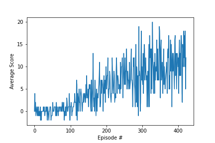

# Project 1: Banana Collector

This project train an agent to navigate and collect bananas in a large, square world.

### Learning Algorithms:

I used Deep Q-Neural Network (DQN) underlying learning algorithms for training the agent. Additionally I have used replay buffer to improve the training. Experience Replay is that save the experience(states, actions, rewards and next states in episodes) to Replay buffer. Therefore get a random samples to learn from saved experience. So we can learn the agent from much more experiences and there less bias in the training.

### Chosen Hyperparameters:

Below are the hyper parameters which are used in this project:
 

BUFFER_SIZE = int(1e6)  &nbsp;&nbsp;&nbsp;&nbsp;# replay buffer size  
BATCH_SIZE = 64         &nbsp;&nbsp;&nbsp;&nbsp;# minibatch size   
GAMMA = 0.99            &nbsp;&nbsp;&nbsp;&nbsp;# discount factor  
LR = 5e-4               &nbsp;&nbsp;&nbsp;&nbsp;# learning rate  
UPDATE_FREQUENCY = 4    &nbsp;&nbsp;&nbsp;&nbsp;# how often to update the network  

### Architecture of Neural Network Used:

The DQN netowrk has four layers. 

1. First layer is the input layer which has 37 nodes , which take states as input.
2. The second and third layer are intermediate layers , each have 64 nodes.
3. The fourth layer is output layer which has 4 nodes ( same as number of actions.)

### Plot of Rewards:

Saved Model: [bcweights.pth](bcweights.pth)

### Ideas for Future Work:

Using Double DQN and Dueling DQN to improve training.
Using Prioritized Experience Replay to further improve the training.

